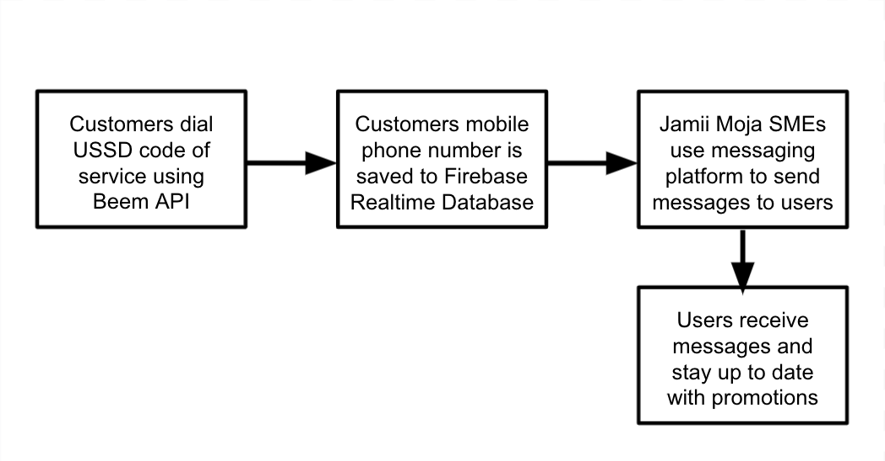

# Demo video

[link](https://drive.google.com/file/d/1MjdoJxM6K1nHdm00c842utfvnfZ-bvOw/view?usp=sharing)

# Jamii Moja SME Platform (Beemathon 2021)

Jamii Moja is an intuitive and easy-to-use community engagement platform 
designed for Small and Medium Enterprises(SMEs) in Africa. You can access the live [demo here](https://beemathon-jk.herokuapp.com) (it has a few bugs). 

# Features

Jamii Moja enables SMEs to engage with their customer base by letting them SMS announcements, promotions, or messages in bulk to all their customers who have signed up via a USSD feature. The platform is motivated by the fact that over 85% of the population in Tanzania has access to SMS and call but only 49% of the country has access to the internet. This platform can be used to connect users who have limited internet connection but still want to get access to promotions and updates from SMEs that they support. 

 The platform sits on top of [Beem Africa’s](https://beem.africa/) SMS and USSD APIs and thus allows producers to have a nationwide reach. 

# How it works

# Architecture

* Flask web server
* Beem USSD API
* Beem SMS API
* Firebase auth
* Firebase Realtime Database

# How to deploy

Jamii Moja uses Heroku to deploy. Vist this [article](https://www.geeksforgeeks.org/deploy-python-flask-app-on-heroku/) to learn more

# Future improvements

1. Add feedback option to USSD and develop feedback page
2. Allow SMEs to develope customer profiles
